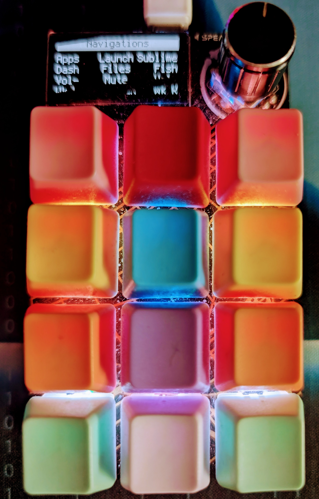

# Macropad Custom Macro's # 
## I hope these will be helpful, they work on Linux & Windows. You will need to add consumer.py and keyconfig.py for some macros to work. There is no code.py editing needed from the default example. ##  

My Custom macros :
```
Github - terminal github commands
Linux-Firefox - Firefox shortcuts works with windows & linux (back&forward on win exception)
Media - media controls
Mouse - self explainatory
Navigation  - Arch based Linux Desktop Navigation
Navigations - Ubuntu baseed Linux Desktop Navigation
Numpad - self explainatory
Tones - Tones macro same as shipped with
Twitter - Twitter shortcuts
Vim - Vim editor terminal command shortcuts
Win-Youtube - Youtube controls 
Zoom - Zoom keyboard shortcuts -- rebind in app to your Macropad, some binds aren't cooperative and have been changed
PyCharm - SADLY NOT WORKING PLEASE HELP!
```


### Video Showing Off : ###

my pad with gateron keys and pastel keycaps -- click for previews video

[](https://youtube.com/shorts/odwaIkPq_Fo?si=74U0X9hWe-VAtiN0)


## Libraries Needed : ## 


# ⻏丫 : 𝓝丫㇄闩尺 #
