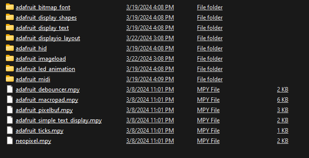

# Macropad Custom Macro's # 
## I hope these will be helpful, they work on Linux & Windows. You will need to add consumer.py and keyconfig.py for some macros to work. There is no code.py editing needed from the default example. ##  

My Custom macros :
```
Gamepad - Top number row for gaming keybinds
Github - terminal github commands
Linux-Firefox - Firefox shortcuts works with windows & linux (back&forward on win exception)
Media - media controls
Mouse - self explainatory
Numpad - " " "
Sleep - All LED's off & Screen Sleep
Twitter - Twitter shortcuts
Vim - Vim editor terminal command shortcuts
Win-Youtube - Youtube controls 
Zoom - Zoom keyboard shortcuts -- rebind in app to your Macropad, some binds aren't cooperative and have been changed
```


### Video Showing Off : ###
pad & the custom macros so you can preview the colors & usages

[](https://youtube.com/shorts/R12l9GxiTE0?si=AsXMO3ngsdSoHTXV)


## Libraries Needed : ## 




# ⻏丫 : 𝓝丫㇄闩尺 #
